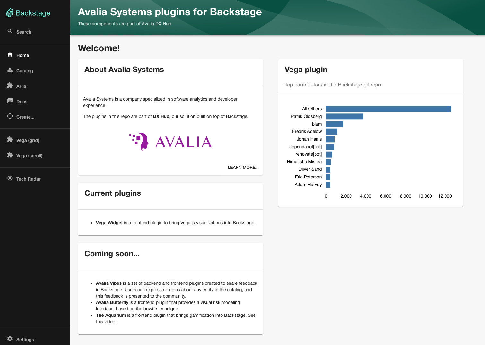

# avalia-backstage-plugins

This repo contains Backstage plugins developed at Avalia Systems. 

## Current plugins

* The first [plugin](https://github.com/AvaliaSystems/avalia-backstage-plugins/tree/main/plugins/backstage-plugin-vega) allows you to bring Vega.js visualizations in your Backstage portal.

## Credits

The idea to develop these plugins in a monorepo, together with a basic Backstage app, was inspired by the [RoadieHQ repo](https://github.com/RoadieHQ/roadie-backstage-plugins).

