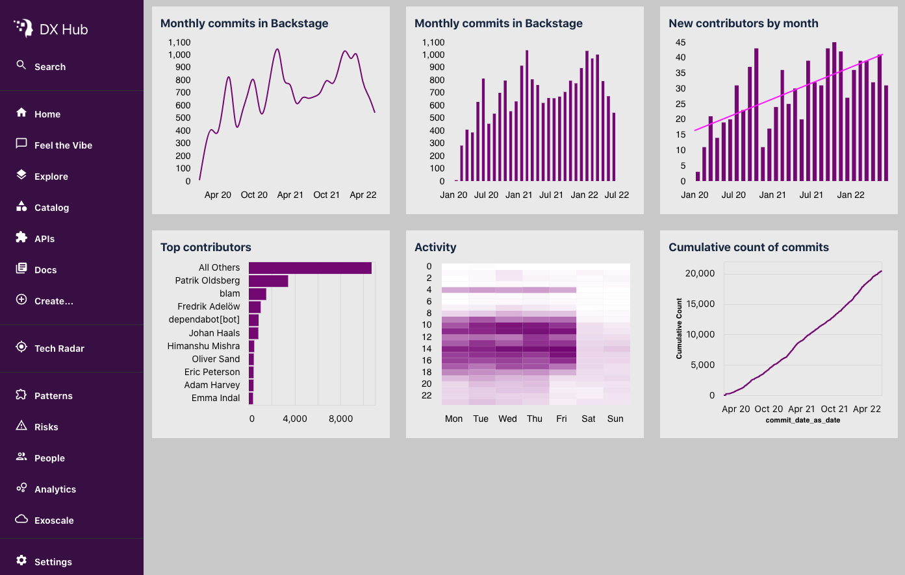

# Avalia Vega Widget

## Introduction

Vega.js and Vega-Lite.js are really nice data visualization libraries. They provide a "visualization grammer" that you can use to specify how a dataset should be represented graphically. The specifications are written in JSON files, which makes them portable across the tools that are based on Vega. 

The goal of this plugin is to make it possible to embed Vega.js visualizations in Backstage. The Vega specifications can be developed and tested outside of Backstage.





## Usage

### Install

```
yarn add @avaliasystems/backstage-plugin-vega
```

### Prepare your dataset and Vega spec

### Add a widget to your page

```
<VegaWidget />
```

### Notes


## Links

* [Backstage](https://backstage.io)
* [Vega](https://github.com/vega/vega)


