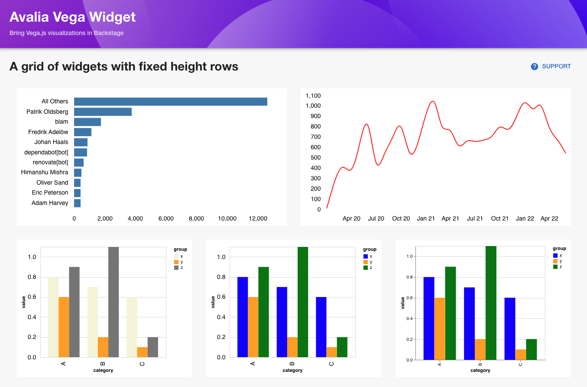

# backstage-plugin-vega


## Overview

The Vega plugin allows you to render a [Vega.js](https://vega.github.io/vega/) specification in your Backstage pages.




## How to use the Vega plugin

1. Install the plugin from the root directory

```bash
yarn add @avaliasystems/backstage-plugin-vega
```

2. Create a vega specification

```
touch `app/public/demo/vega-widget/git-authors.json`
```

3. Add the widget to a page and reference the vega specification

```
import {
  VegaWidget,
  VegaLibrary,
} from '@avaliasystems/plugin-backstage-plugin-vega';
```

```
const useStyles = makeStyles(() => ({
  grid: {
    display: 'flex',
  },
  item: {
    padding: '1rem',
    flexGrow: 1,
    flexShrink: 1,
    height: '350px',
    width: '300px'
  },
}));
```

```
<div className={classes.grid}>
  <div className={classes.item}>
    <VegaWidget
      library={VegaLibrary.VEGA}
      specUrl="/demo/vega-widget/git-authors.json"
    />
  </div>
  <div className={classes.item}>
    <VegaWidget
      library={VegaLibrary.VEGA}
      specUrl="/demo/vega-widget/monthly-commits-line.json"
      overrideConfig
    />
  </div>
</div>
```


## TODO

* **Improve dynamic sizing**. There are different ways to manage the size of charts rendered by Vega. If you provide fixed width and height, this is easy to handle. However, if you want the chart to use available space as the user resizes the window, the situation is a bit tricky. As demonstrated in the `Vega (grid)` example page, we have a solution for this use case. However, it requires all DOM ancestors to have the `overflow: auto` property set.
* **Add wrapper components**. At the moment, the page developer has to create the "frame" into which the Vega widget will be rendered. In the example pages, the page developer is creating and styling the grid that will host the charts. This gives a lot of flexibility to developers, but it has some onboarding cost. We plan to add some ready-to-use components that would make it faster to create dashboard pages, or widget "rows" in an entity tab.
* **Improve and document theming**. It is possible to update a Vega specification, both when it is first loaded and afterwards. With some conventions in the Vega specifications, it is possible to inject Backstage theme properties into the chart. We have already made some experiments and it works well, but have work to improve and document the solution.


## Notes

Your plugin has been added to the example app in this repository, meaning you'll be able to access it by running `yarn start` in the root directory, and then navigating to [/backstage-plugin-vega](http://localhost:3000/backstage-plugin-vega).

You can also serve the plugin in isolation by running `yarn start` in the plugin directory.
This method of serving the plugin provides quicker iteration speed and a faster startup and hot reloads.
It is only meant for local development, and the setup for it can be found inside the [/dev](./dev) directory.
